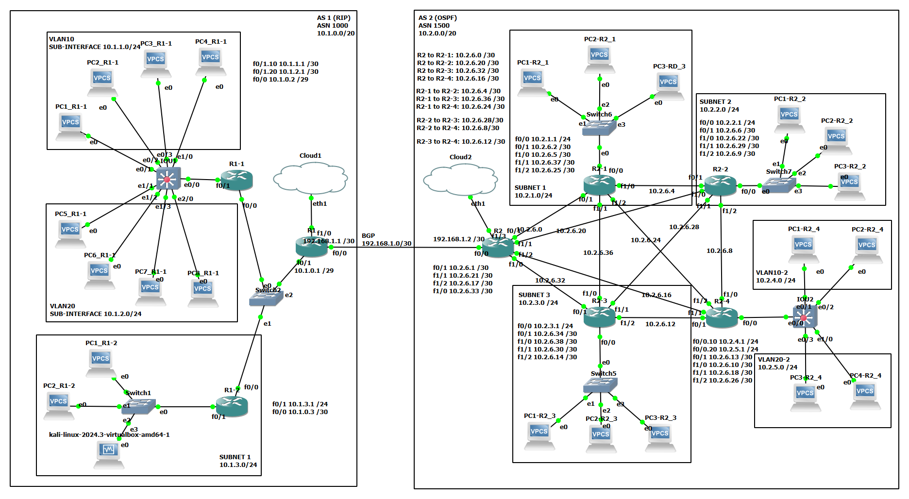

<h1>GNS3 Project</h1>
    
<strong>Project:</strong> gns3-project

    
<strong>Created on:</strong> 2024-10-29

    
<strong>Author:</strong> Adinda Yulia Safitri (<a href="mailto:adindaysafitri@gmai.com">adindaysafitri@gmail.com</a>)

<h2>Topology Overview</h2>

    <ul>
        <li><strong>Jenis Topologi:</strong>
            <ul>
                <li><strong>AS1:</strong> Topologi Star</li>
                <li><strong>AS2:</strong> Kombinasi Topologi Star dan Mesh</li>
            </ul>
        </li>
        <li><strong>Protokol Routing:</strong>
            <ul>
                <li><strong>AS1:</strong> RIP</li>
                <li><strong>AS2:</strong> OSPF</li>
            </ul>
        </li>
        <li><strong>Jaringan:</strong>
            <ul>
                <li><strong>AS1:</strong> 10.1.0.0/20 (1 subnet, 2 VLAN)</li>
                <li><strong>AS2:</strong> 10.2.0.0/20 (3 subnet, 2 VLAN)</li>
                <li>Koneksi antar-AS: 192.168.1.0/30 (BGP)</li>
            </ul>
        </li>
        <li><strong>IP Assignment:</strong> Semua client di kedua AS mendapatkan IP secara dinamis.</li>
    </ul>

<h2>AS1 (ASN 1000)</h2>
    <ul>
        <li><strong>Karakteristik:</strong>
            <ul>
                <li>Jaringan skala kecil-menengah dengan mobilitas tinggi.</li>
                <li>Menggunakan topologi Star.</li>
                <li>Menerapkan dynamic routing protocol RIP.</li>
            </ul>
        </li>
        <li><strong>Jaringan Internal:</strong>
            <ul>
                <li><strong>VLAN10:</strong> 10.1.1.0/24</li>
                <li><strong>VLAN20:</strong> 10.1.2.0/24</li>
                <li><strong>SUBNET1:</strong> 10.1.3.0/24</li>
                <li><strong>Jaringan antar-router:</strong> 10.1.0.0/29</li>
            </ul>
        </li>
        <li><strong>Perangkat dan Fungsinya:</strong>
            <ul>
                <li><strong>R1:</strong> Router utama/edge router.</li>
                <li><strong>R1-1:</strong> Terhubung pada Switch IOU untuk menghubungkan perangkat jaringan VLAN ke jaringan luar.</li>
                <li><strong>R1-2:</strong> Terhubung pada Switch1 untuk menghubungkan perangkat SUBNET1 ke jaringan luar.</li>
                <li><strong>Switch IOU:</strong> Digunakan untuk routing dan switching di jaringan VLAN.</li>
            </ul>
        </li>
    </ul>

<h2>AS2 (ASN 1500)</h2>
    <ul>
        <li><strong>Karakteristik:</strong>
            <ul>
                <li>Jaringan kompleks dengan keandalan tinggi.</li>
                <li>Kombinasi topologi Mesh dan Star.</li>
                <li>Menerapkan dynamic routing protocol OSPF.</li>
            </ul>
        </li>
        <li><strong>Jaringan Internal:</strong>
            <ul>
                <li><strong>Subnet1:</strong> 10.2.1.0/24</li>
                <li><strong>Subnet2:</strong> 10.2.2.0/24</li>
                <li><strong>Subnet3:</strong> 10.2.3.0/24</li>
                <li><strong>VLAN10-2:</strong> 10.2.4.0/24</li>
                <li><strong>VLAN20-2:</strong> 10.2.5.0/24</li>
            </ul>
        </li>
        <li><strong>Perangkat dan Fungsinya:</strong>
            <ul>
                <li><strong>R2:</strong> Router utama/edge router.</li>
                <li><strong>R2-1:</strong> Terhubung pada Switch6 untuk menghubungkan perangkat SUBNET1 ke jaringan luar.</li>
                <li><strong>R2-2:</strong> Terhubung pada Switch7 untuk menghubungkan perangkat SUBNET2 ke jaringan luar.</li>
                <li><strong>R2-3:</strong> Terhubung pada Switch5 untuk menghubungkan perangkat SUBNET3 ke jaringan luar.</li>
                <li><strong>R2-4:</strong> Terhubung dengan Switch IOU yang menghubungkan VLAN10-2 dan VLAN20-2.</li>
            </ul>
        </li>
    </ul>
